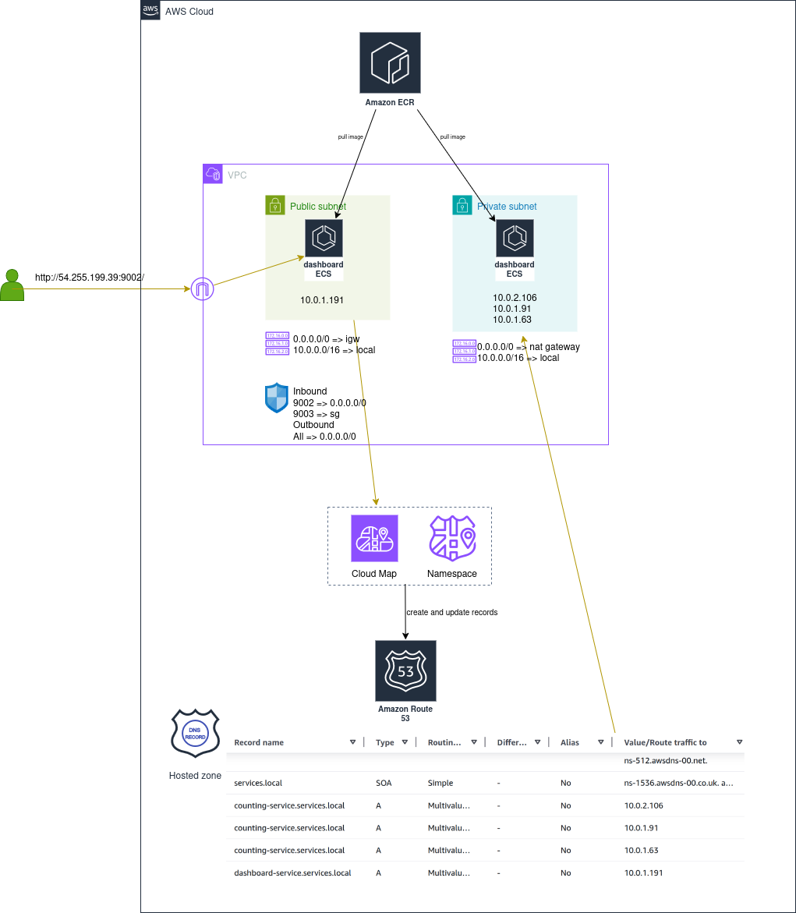

# AWS ECS Service Connect + TLS Demo

This project demonstrates service-to-service communication on AWS ECS Fargate using ECS Service Connect with TLS encryption.

Reference: https://docs.aws.amazon.com/AmazonECS/latest/developerguide/service-connect.html

## Architecture Overview



## What this deploys

- 1 ECS cluster: `services-cluster`
- 2 ECS services:
  - `dashboard-service` exposed on port `9002` (public subnet)
  - `counting-service` internal on port `9003` (private subnet)
- ECS Service Connect namespace: `services.local` (Cloud Map HTTP namespace)
- Service Connect aliases:
  - `dashboard-dns:80`
  - `counting-dns:80`
- TLS between service proxies using ACM Private CA
- ECR repositories and image push flow

## Service-to-service call path

`dashboard-service` calls `counting-service` through Service Connect alias:

`COUNTING_SERVICE_URL=http://counting-dns`

## Deploy

```bash
terraform init
terraform validate
terraform apply -auto-approve
```

## Validation walkthrough

### 1) Open shell inside dashboard task

```bash
aws ecs execute-command --cluster services-cluster \
  --task <dashboard-task-arn> \
  --container dashboard-service \
  --region ap-southeast-1 \
  --profile master-user \
  --interactive \
  --command "/bin/sh"
```

### 2) Verify Service Connect DNS alias

Inside dashboard container:

```bash
apk update && apk add curl
curl -iv http://counting-dns
#output
* Host counting-dns:80 was resolved.
* IPv6: 2600:f0f0::1
* IPv4: 127.255.0.1
*   Trying [2600:f0f0::1]:80...
* Immediate connect fail for 2600:f0f0::1: Network unreachable
*   Trying 127.255.0.1:80...
* Established connection to counting-dns (127.255.0.1 port 80) from 127.0.0.1 port 41076 
* using HTTP/1.x
> GET / HTTP/1.1
> Host: counting-dns
> User-Agent: curl/8.17.0
> Accept: */*
> 
* Request completely sent off
< HTTP/1.1 200 OK
HTTP/1.1 200 OK
< Date: Tue, 24 Feb 2026 13:42:18 GMT
Date: Tue, 24 Feb 2026 13:42:18 GMT
< Content-Length: 73
Content-Length: 73
< Content-Type: text/plain; charset=utf-8
Content-Type: text/plain; charset=utf-8
< 

* Connection #0 to host counting-dns:80 left intact
{"count":64,"hostname":"ip-10-0-102-186.ap-southeast-1.compute.internal"}
```

### 3) Verify TLS certificate presented by counting service proxy

Inside dashboard container:

```bash
apk add openssl
openssl s_client -connect 10.0.102.186:9003 < /dev/null 2> /dev/null | openssl x509 -noout -text
```

Observed result from test:
- Certificate returned successfully
- `Issuer: O=Test`
- Subject Alternative Name includes `DNS:counting-dns.services.local`
- Extended Key Usage includes server and client authentication

This confirms Service Connect TLS is active on the internal service-to-service path.

### 4) Verify dashboard public endpoint

Open:

`http://<dashboard_public_ip>:9002`

