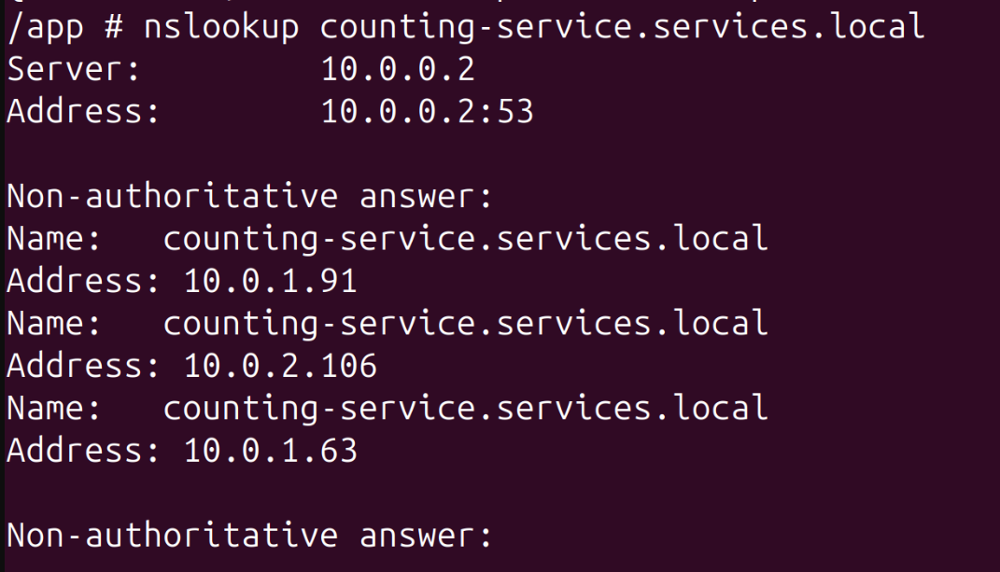
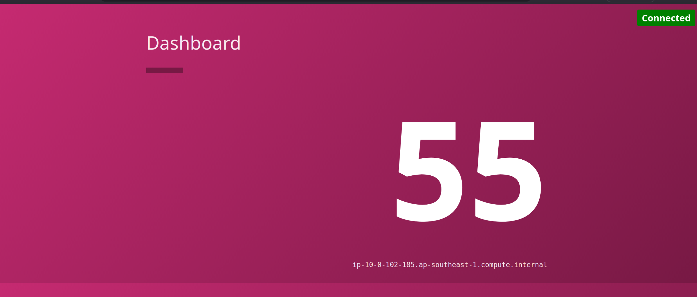
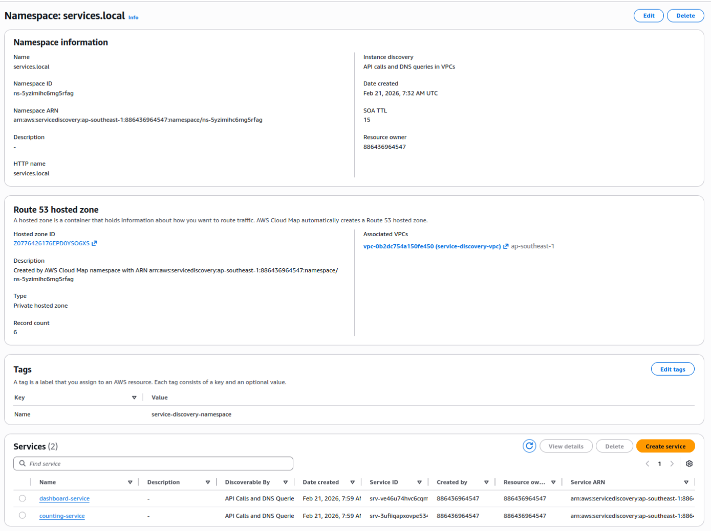
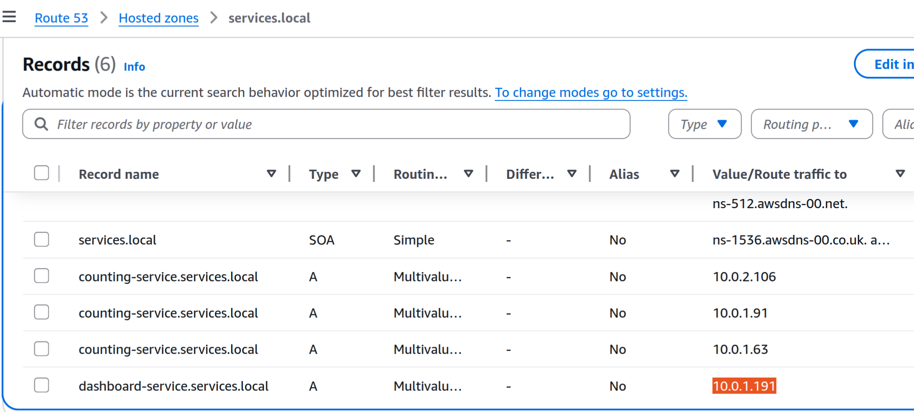
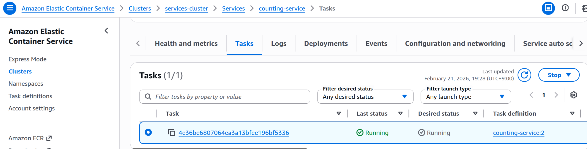
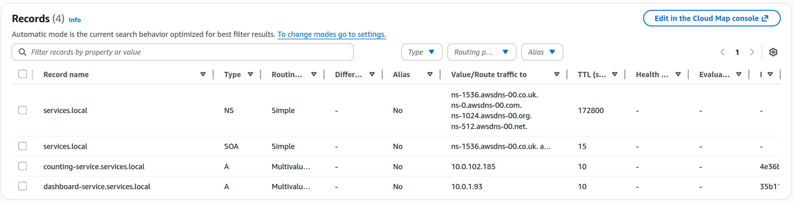

# AWS ECS Service Discovery Demo

This project demonstrates production-style service discovery on AWS ECS Fargate using AWS Cloud Map private DNS.

Reference: https://docs.aws.amazon.com/AmazonECS/latest/developerguide/service-discovery.html

## Architecture Overview


## What this deploys

- 1 ECS cluster: `services-cluster`
- 2 ECS services:
  - `dashboard-service` on port `9002` (publicly reachable)
  - `counting-service` on port `9003` (internal-only, private subnets)
- Cloud Map private namespace: `services.local`
- ECR repositories and image push flow
- Security group rules:
  - Internet -> `dashboard-service:9002`
  - ECS tasks -> `counting-service:9003`

## Service-to-service call path

`dashboard-service` resolves and calls:

`COUNTING_SERVICE_URL=http://counting-service.services.local:9003`

## Deploy

```bash
terraform init
terraform validate
terraform apply -auto-approve
```

## Validation walkthrough

### 1) Open a shell in dashboard task

```bash
aws ecs execute-command --cluster services-cluster \
    --task arn:aws:ecs:ap-southeast-1:886436964547:task/services-cluster/233b213e05134ceab7ab934da47d65ca \
    --container dashboard-service --region ap-southeast-1 --profile master-user \
    --interactive \
    --command "/bin/sh"
```

### 2) Verify DNS resolution for counting service

Inside dashboard container:

```bash
nslookup counting-service.services.local
```


### 3) Verify public access to dashboard

Open:

`http://<dashboard_service_public_ip>:9002`

Evidence:



### 4) Verify Cloud Map + Route 53 records

Cloud Map namespace/services:



Route 53 private hosted zone records:



## Scale-down test (service discovery consistency)

Scale `counting-service` down and verify DNS updates accordingly.

Counting service at 1 running task:



Route 53 reflects updated service instance set:



Re-check from dashboard container:

```bash
nslookup counting-service.services.local
#output
Server:		10.0.0.2
Address:	10.0.0.2:53

Non-authoritative answer:
Name:	counting-service.services.local
Address: 10.0.1.63

Non-authoritative answer:
```


